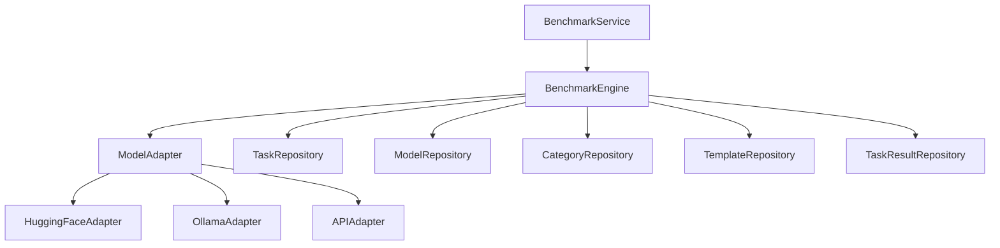

# Application State Documentation

## How to work with this document

This document tracks the state of the project and is updated by the Project Manager AI and AI Developer based on their roles.

- **Project Manager AI:** Add new features to "Action Points" or errors to "Known Issues" as requested by the human developer. See `project_manager_workflow.md`.
- **AI Developer:** Implement tasks from "Action Points," fix bugs from "Known Issues," and update "Current State" after every task. See `ai_developer_workflow.md`.

## Current State

### Core Implementation Details

#### Service Architecture


#### Service Dependencies
- **BenchmarkService**:
  - Depends on: CategoryService (weights), ModelService (adapters), TaskService (execution), TemplateService (validation)
  - Manages: Benchmark lifecycle, result aggregation
  - State: Tracks active runs in memory

- **CategoryService**:
  - Standalone service for category management
  - Defines scoring weights used by BenchmarkService

- **TaskService**:
  - Depends on: TemplateService (validation), CategoryService (organization)
  - Used by: BenchmarkService for task execution

- **TemplateService**:
  - Core service for task validation and criteria definition
  - Used by: TaskService, BenchmarkService

- **ModelService**:
  - Manages model configurations
  - Provides adapter factory for model execution

- **ImportExportService**:
  - Manages data export/import operations

#### Key Workflows

1. **Benchmark Execution**:
   ```mermaid
   sequenceDiagram
       participant C as Client
       participant BS as BenchmarkService
       participant BE as BenchmarkEngine
       participant MA as ModelAdapter
       participant R as Repositories
       
       C->>BS: start_benchmark(id)
       BS->>BE: execute_benchmark(id)
       BE->>R: get_models_and_tasks()
       loop For each model/task
           BE->>MA: initialize()
           BE->>MA: generate(prompt)
           MA-->>BE: response
           BE->>BE: evaluate_results()
       end
       BE->>R: save_results()
       BS-->>C: benchmark_run
   ```

2. **Task Template Flow**:
   ```mermaid
   sequenceDiagram
       participant TS as TaskService
       participant TeS as TemplateService
       participant R as Repository
       
       TS->>TeS: validate_task(task, template_id)
       TeS->>R: get_template(template_id)
       TeS->>TeS: validate_input_schema()
       TeS->>TeS: validate_output_schema()
       TeS-->>TS: validation_result
   ```
3. Data Flow
  ```mermaid
  graph LR
       Client --> API(routes.py)
       API --> BenchmarkService(services.py)
       API --> CategoryService(services.py)
       API --> TaskService(services.py)
       API --> TemplateService(services.py)
       API --> ModelService(services.py)
       API --> ImportExportService(services.py)
       BenchmarkService --> BenchmarkEngine(services.py)
       BenchmarkEngine --> ModelAdapter(app/adapters/base.py)
       ModelAdapter --> HuggingFaceAdapter(app/adapters/huggingface.py)
       ModelAdapter --> OllamaAdapter(app/adapters/ollama.py)
       ModelAdapter --> APIAdapter(app/adapters/api.py)
       BenchmarkEngine --> Repositories(repositories.py)
       CategoryService --> Repositories(repositories.py)
       TaskService --> Repositories(repositories.py)
       TemplateService --> Repositories(repositories.py)
       ModelService --> Repositories(repositories.py)
       ImportExportService --> Repositories(repositories.py)
       Repositories --> DataFiles(data/*.json)
   ```
#### Current Limitations

1. **Execution Constraints**:
   - Single benchmark execution per model at a time
   - No parallel task execution within a benchmark
   - Synchronous score calculation
   - No caching of model responses

2. **Storage Limitations**:
   - JSON file-based storage without indexing
   - Full file reads for queries
   - No atomic operations for concurrent writes
   - No automatic cleanup of old results

3. **Model Constraints**:
   - Limited error recovery for failed model calls
   - No automatic model parameter optimization
   - Basic token counting implementation
   - No streaming response aggregation

4. **Memory Management**:
   - Active benchmarks stored in memory
   - No memory limits for model responses
   - Results kept in memory during benchmark

#### Implementation Patterns

1. **Repository Pattern**:
   - JSON file-based implementation
   - Entity-specific repositories
   - Basic CRUD operations
   - No transaction support

2. **Adapter Pattern** (Models):
   ```python
   ModelAdapter (ABC)
   ├── HuggingFaceAdapter
   │   └── handle_specific_params()
   └── OllamaAdapter
       └── handle_specific_params()
   ```

3. **Factory Pattern** (Model Creation):
   ```python
   ModelAdapterFactory
   ├── create_adapter(model_config)
   └── register_adapter(adapter_class)
   ```

4. **Strategy Pattern** (Scoring):
   ```python
   ScoreCalculator
   ├── TimeScoreStrategy
   ├── QualityScoreStrategy
   ├── ComplexityScoreStrategy
   ├── CostScoreStrategy
   └── MemoryScoreStrategy
   ```

## Action Points (What should be implemented next)

Okay, here's the "Action Points" section, restructured to focus on the remaining tasks, using the detailed, file-linked format:

### Known Issues

### Tasks

#### Task: Set up Docker Configuration

*   **Files Affected:**
    *   `Dockerfile`: Create a Dockerfile for building the backend image.
    *   `docker-compose.yml`: Create a docker-compose file for development.
    *   `docker-compose.prod.yml`:(Optional) Create a separate docker-compose file for production.
    *   `.dockerignore`: Create a .dockerignore file to exclude unnecessary files/directories.

*   **Sub-Tasks:**
    1.  Create a `Dockerfile` that:
        *   Uses a suitable Python base image (e.g., `python:3.12-slim`).
        *   Sets up a working directory.
        *   Copies the application code.
        *   Installs dependencies using `pip` (from `requirements.txt`).
        *   Exposes the correct port (e.g., 8000).
        *   Defines the command to run the application (e.g., `uvicorn app.main:app --host 0.0.0.0 --port 8000`).
    2.  Create a `docker-compose.yml` file that:
        *   Defines a service for the backend (using the Dockerfile).
        *   Maps the container port to the host port.
        *   Mounts the application code as a volume (for development, to enable hot reloading).
        *   Sets environment variables (from a `.env` file or directly).
        *   (Optional) Defines services for other components, like a database (if you move away from JSON files).
    3. (Optional) Create a `docker-compose.prod.yml` that uses multi-stage builds in `Dockerfile` for smaller production image, sets necessary environment variables, and does *not* mount the source code as a volume.
    4. Create a `.dockerignore` file to exclude things like `.git`, `__pycache__`, `tests`, etc., from the Docker image.
    5.  Test the Docker setup:
       *  `docker compose build`
       * `docker compose up`
       * Verify that the API is accessible.

*   **Considerations:**
    *   Multi-stage builds: Use multi-stage builds in the `Dockerfile` to create smaller, more efficient production images.
    *  Separate `docker-compose` files: Consider separate files for development and production (`docker-compose.yml` and `docker-compose.prod.yml`).
    *   Database: If you eventually move to a database (e.g., PostgreSQL), add a service for it in `docker-compose.yml`.

### Core Backend Services

#### Task: Implement Model Adapters for API Providers

*   **Files Affected:**

    *   `app/adapters/api.py`: Create the `APIAdapter` class.
    *   `app/adapters/base.py`:  Register the `APIAdapter` with the `ModelAdapterFactory`.
    *   `app/services/model_service/service.py`: (No changes if factory is used correctly)
    *   `app/services/model_service/models.py`: Ensure models accommodate API parameters.
    *   `app/services/model_service/schemas.py`: Update schemas for API adapter.
    *   `app/enums.py`: Ensure `ModelTypeEnum` includes `CUSTOM_API`.
    *    `tests/adapters/test_api.py`: Add tests for the new adapter.

*   **Sub-Tasks:** (Detailed in previous response, summarized here)
    1.  Create `APIAdapter` class, inheriting from `ModelAdapter`.
    2.  Implement `initialize` (set up HTTP client, e.g., `httpx`).
    3.  Implement `generate` (make API requests, handle authentication, parse responses).
    4.  Implement `generate_stream` (handle streaming responses, if applicable).
    5.  Implement `get_token_count` (estimate or use API endpoint if available).
    6.  Implement `cleanup` (close HTTP client).
    7.  Register `APIAdapter` with `ModelAdapterFactory`.
    8.  Add comprehensive tests.

*   **Considerations:**
    *   Flexibility for different API formats.
    *   Robust error handling (retries, timeouts).
    *   Secure credential management.

### API Endpoints

#### Task: Set up API Documentation with Examples

*   **Files Affected:**
    *   `main.py`: Configure FastAPI documentation.
    *   `routes.py`:  Add docstrings and examples.

*   **Sub-Tasks:**
    1.  FastAPI auto-generates documentation.
    2.  Enhance with:
        *   Detailed docstrings for each route.
        *   Examples in request/response schemas (`Field(..., examples=[...])`).
        *  Response descriptions using `responses` in route decorators.
    3.  (Optional) Add a README with API usage examples.

### Frontend Structure

#### Task: Implement Three-Panel Layout

* **Files Affected:**
    *   `ui/src/routes/+layout.svelte`: (Or similar layout file)

*   **Sub-Tasks:**
      1. Create main app using Svelte `{#if}` blocks and routing to determine what is showed in main content area
    1.  Create the three-panel layout structure using HTML and Tailwind classes:
        *   Left sidebar (navigation).
        *   Main content area.
        *   Right panel (configuration/details).
    2.  Implement collapsible panels (using Svelte's reactivity).
    3.  Implement persistent status bar.
    4. Create components for each part of the layout.

### UI Components

#### Task: Develop Dashboard

*   **Files Affected:**
    *   `ui/src/routes/+page.svelte`: (Or similar route file for the dashboard).
    *   `ui/src/lib/components/`:  Create specific dashboard components (e.g., `MetricCard.svelte`, `Chart.svelte`).

*   **Sub-Tasks:**
    1.  Design the dashboard layout.
    2.  Create reusable components for displaying metrics and charts.
    3.  Fetch data from the API (using Svelte's `fetch` or a dedicated API client).
    4.  Display data in the components.
    5.  Implement interactive elements (e.g., filtering, sorting).

#### Task: Create Category Management Interface, Implement Task Editor, Build Model Configuration Panels, Design Results Visualization Components, Implement Benchmark Execution UI

These tasks follow the same general pattern as "Develop Dashboard":

*   Create Svelte components for each UI element.
*   Fetch data from the API.
*   Display data.
*   Implement user interactions (forms, buttons, drag-and-drop, etc.) - use skeleton UI for this
*   Use Tailwind for consistent design

### Import/Export Functionality

#### Task: Add UI for Export/Import Workflows

*   **Files Affected:**
    *   `ui/src/routes/import-export/+page.svelte`: (Or similar route file).
    *   `ui/src/lib/components/`: Create specific components (e.g., `FileUpload.svelte`, `ImportPreviewTable.svelte`).

* **Sub-Tasks:**
    1.  Create a UI for selecting the export type and entity IDs.
    2.  Trigger the export API endpoint and initiate a file download.
    3.  Create a UI for uploading import files.
    4.  Call the import preview API endpoint.
    5.  Display the import preview data, highlighting conflicts.
    6.  Provide UI elements for resolving conflicts (skip, overwrite, rename).
    7.  Call the import execution API endpoint.
    8. Display progress.

### Testing

#### Task: Set up Unit Testing for Backend Services

*   **Files Affected:**
    *   `tests/`: Create test files for each service (e.g., `tests/services/test_benchmark_service.py`).

*   **Sub-Tasks:**
    1.  Choose a testing framework (e.g., `pytest`).
    2.  Write unit tests for each method in the service classes.
    3.  Use mocking to isolate the service from its dependencies (e.g., repositories, model adapters).
    4.  Test various scenarios, including success cases, error cases, and edge cases.

#### Task: Create Integration Tests for API Endpoints

* **Files Affected:**
   *  `tests/routes/`: Create files for each route (e.g., `tests/routes/test_benchmark.py`

*   **Sub-Tasks:**
    1.  Use a testing framework (e.g., `pytest`) and an HTTP client (e.g., `httpx`) to make requests to the API endpoints.
    2.  Test various scenarios, including:
        *   Successful requests with valid data.
        *   Requests with invalid data (validation errors).
        *   Requests that trigger errors in the services.
        *   Requests that require authentication/authorization.
    3.  Assert the expected status codes, response bodies, and headers.

#### Task: Implement Frontend Component Tests

*   **Files Affected:**
    *   `ui/src/lib/components/__tests__/`: Create test files for each component (e.g., `ui/src/lib/components/__tests__/Button.test.ts`).

*   **Sub-Tasks:**
    1.  Choose a testing framework (e.g., `Vitest`, `Jest`, `@testing-library/svelte`).
    2.  Write tests to verify that components:
        *   Render correctly with different props.
        *   Handle user interactions correctly.
        *   Emit the expected events.
        *   Update their state correctly.

#### Task: Design Sample Benchmarks

* **Files Affected:**
   *   `data/`: Create sample data files (categories, tasks, templates, models, results).
* **Sub-Tasks**:
   * Create sample JSON files for a few different categories.
   * Design sample templates for different categories and complexity.
   * Add sample tasks using these templates.
   * Configure a few models (at least one HuggingFace and one Ollama) for testing.
   * Create scripts or tools to populate initial state using API.

### Documentation

#### Task: Document API Endpoints, Create User Guide, Prepare Developer Documentation

*   **Files Affected:**
    *   `docs/`: Create documentation files (e.g., `README.md`, API reference, user guide, developer guide).

*   **Sub-Tasks:**
    1.  **API Endpoints:**  FastAPI's automatic documentation is a good start. Supplement this with:
        *   A comprehensive README that explains how to use the API.
        *   Examples of API requests and responses.
        *   (Optional) A separate API reference document (e.g., using Swagger/OpenAPI).
    2.  **User Guide:**  Create a user guide that explains how to:
        *   Install and configure the application.
        *   Create and manage categories, tasks, templates, and models.
        *   Run benchmarks.
        *   View and interpret results.
        *   Import and export data.
    3.  **Developer Documentation:** Create a developer guide that explains:
        *   The project structure and architecture.
        *   How to contribute to the project.
        *   How to add new model adapters.
        *   How to add new features.
        *   How to run tests.
        *   Coding standards and conventions.

### Deployment

#### Task: Configure Docker Compose for Production, Set up Volume Mapping, Create Environment Configuration

* **Files Affected:**
    *   `docker-compose.prod.yml`: (Or similar production-specific compose file).
    *   `.env.prod`: (Or similar production-specific environment file).

* **Sub-Tasks**:
   1. Create `docker-compose.prod.yml` with necessary settings for production:
        *  Use the production Docker image (built with multi-stage builds if applicable).
        *  Set appropriate environment variables (e.g., `LOCALAI_BENCH_DEBUG=False`, database connection strings).
        *  Do *not* mount the source code as a volume.
        *  (Optional) Configure a reverse proxy (e.g., Nginx, Traefik) for SSL termination and load balancing.
   2.  Set up volume mapping for persistent storage in `docker-compose.prod.yml`:
        *   Create named volumes for data directories (e.g., `data/categories`, `data/tasks`, etc.).
        *   Map these volumes to the appropriate directories within the container.
        * This ensures that data persists even if the container is restarted.
    3. Create an environment configuration template (`.env.example` or similar).  This file should list all the required environment variables with example values.  This makes it easy for users to configure their own deployments.
    4. Create separate `.env.prod` file with production settings.


### Initial Project Setup
- [x] Create a project structure
- [x] Create config.py with application settings and environment variables
- [ ] Set up Docker configuration for development environment

### Data Models
- [x] Create models.py with Pydantic models for:
  - [x] Category
  - [x] Task
  - [x] Template
  - [x] Model
  - [x] BenchmarkResult
- [x] Create enums.py with Enums for:
  - [x] TaskStatus
  - [x] TemplateType
  - [x] EvaluationCriteriaType
  - [x] ModelType
  - [x] DataType
  - [x] ImportExportType

### Core Services Schemas
- [x] Implement service-specific schemas:
  - [x] Category service schemas
  - [x] Task service schemas
  - [x] Template service schemas
  - [x] Model service schemas
  - [x] Import/Export service schemas
  - [x] Benchmark service schemas
  - [x] Score calculation schemas
  - [x] Task result schemas

### Data Storage
- [x] Implement JSON-based data storage utilities in utils.py
- [x] Create repositories.py with data access functions
- [x] Set up file organization structure as defined in project plan
- [x] Implement versioning for data files

### Core Backend Services
- [x] Create services.py with core benchmark engine logic
  - [x] Implement BenchmarkEngine class
  - [x] Implement task execution logic
  - [x] Add score calculation with configurable weights
  - [x] Add progress tracking and status updates
  - [x] Add error handling and logging
  - [x] Add support for cancelling benchmarks
  - [x] Add aggregate score calculation
  - [x] Add quality score evaluation
  - [x] Add complexity score calculation
- [x] Implement model adapters for Hugging Face integration
- [x] Implement model adapters for Ollama integration
- [ ] Implement model adapters for API providers
- [x] Create task management system with template support
  - [x] Task validation against templates
  - [x] Template-based evaluation criteria
  - [x] Input/output schema validation
  - [x] Test case management
- [x] Implement scoring calculation with configurable weights
  - [x] Time score calculation with normalization
  - [x] Quality score with template criteria evaluation
  - [x] Complexity score based on task/template analysis
  - [x] Cost score based on token usage tracking
  - [x] Memory usage score with normalization
  - [x] Ultimate score with weighted components
  - [x] Aggregate scores by model and category

### API Endpoints
- [x] Set up FastAPI in main.py
- [x] Create schemas.py for request/response models
- [x] Implement structure in routes.py with endpoints for:
  - [x] Category management
  - [x] Task management
  - [x] Template management
  - [x] Model configuration
  - [x] Benchmark execution
  - [x] Results retrieval
  - [x] Status monitoring
  - [x] Benchmark cancellation
- [x] Implement routes functionalities
  - [x] Proper error handling
  - [x] Input validation
  - [x] Type safety
  - [x] Response models
  - [x] Status codes
  - [x] Error responses
  - [x] Success responses
- [ ] Set up API documentation with examples

### Frontend Structure
- [x] Set up Svelte 5 project with TypeScript
- [ ] Configure Tailwind CSS
- [ ] Create component library based on UI design specs
- [ ] Implement three-panel layout structure

### UI Components
- [ ] Develop dashboard with overview metrics
- [ ] Create category management interface
- [ ] Implement task editor with template support
- [ ] Build model configuration panels
- [ ] Design results visualization components with charts
- [ ] Implement benchmark execution UI with progress indicators

### Import/Export Functionality
- [x] Create export utilities for benchmark suites, categories, tasks, and results
- [x] Implement import process with validation and conflict resolution
- [ ] Add UI for export/import workflows

### Testing
- [ ] Set up unit testing for backend services
- [ ] Create integration tests for API endpoints
- [ ] Implement frontend component tests
- [ ] Design sample benchmarks for system testing

### Documentation
- [ ] Document API endpoints
- [ ] Create user guide for benchmark creation
- [ ] Prepare developer documentation

### Deployment
- [ ] Configure Docker compose for production deployment
- [ ] Set up volume mapping for persistent storage
- [ ] Create environment configuration templates


