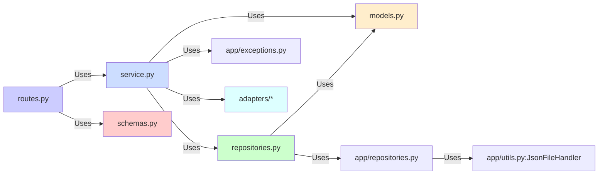

# LocalAI Bench
Your personal AI benchmarking tool.

## Introduction
LocalAI Bench is a benchmarking tool for AI models. It provides a platform to evaluate and compare different AI models based on various tasks and categories. It supports multiple AI models from Hugging Face hub via custom implementation or Ollama API. It also supports models from other API providers.

## Goal
The goal of LocalAI Bench is to provide a platform to evaluate and compare different AI models based on various tasks which are useful for the user.

It not aims to compare SOTA models, but a locally available models which are useful in a stituation where API usage is not recommended choise - like in a corporate environment, where data privacy is a concern or to reduce the cost of API usage.

Unlike other benchmarking tools, LocalAI Bench is not to provide a score on a general field, like Math, Physics or reasoning capabilites, but to compare AI models in categories usefull for the user like:
- specific document types understanding,
- agentic usage in a unique enterprise process,
- coding tasks on a specific language or framework or event corporate coding standards.


## Categories of benchmarks:
There is no limit to the number of categories and tasks that can be added to LocalAI Bench. The first version of LocalAI Bench will contain 3 default categories:

- Coding specific to User Interface (Vision)
  - Example tasks: Implement change in the  UI components based on the user graphical instructions.
- Corporate Document Understanding
  - Example tasks: Extract information from invoices in specific format; summarize legal documents; classify internal documents based on few examples.
- Agentic usage in recruitment process
  - Example tasks: Automate candidate screening workflows; generate personalized 
    candidate feedback.


## Scoring
For each task, there are multiple tasks with different complexity levels and scoring criteria.
Scoring criteria now include:
- Time Score: Based on execution time relative to an expected baseline (if defined).
- Quality Score: How good the solution is based on user judgment or automated evaluation (scale 1 to 10).
- Complexity Score: Reflects the inherent difficulty of the task (derived from task properties or weights).
- Cost Score: Represents the computational cost or API cost (if applicable).
- Memory Score: Measures memory consumption during execution.

These scores are represented using `ScoreComponent` objects, each containing a raw score, a normalized score (typically 0-1), and a weight.

The final `ultimate_score` for a task result is calculated as a weighted sum of the normalized scores of its components. The weights can be configured per task via the `evaluation_weights` field in the `Task` model (e.g., `evaluation_weights: EvaluationWeights | None = Field(default=None, description="Evaluation weights for the task")`).

A proposed formula structure (implemented in `BenchmarkEngine.update_task_result_score`):

Ultimate Score = (
    (time_score.normalized_score * time_weight) +
    (quality_score.normalized_score * quality_weight) +
    (complexity_score.normalized_score * complexity_weight) +
    (cost_score.normalized_score * cost_weight) +
    (memory_score.normalized_score * memory_weight)
) * 10  # Scaled to 0-10

*Note: The current implementation in `BenchmarkEngine.update_task_result_score` needs alignment to correctly use the `evaluation_weights` defined in the `Task` model instead of hardcoded weights or non-existent task fields like `complexity` and `expected_time_seconds`.*

### Automated Evaluation
For objective measurement of Quality Score, the system will implement:
- Unit test validations for coding tasks
- Ground truth comparison for document understanding
- Rule-based evaluation for recruitment process tasks
- Manual review option with structured rubrics for subjective assessment

### Dashboard
The dashboard provides a summary of the scores for each model in each category, with:
- Comparative visualizations (radar charts, bar graphs)
- Detailed performance breakdowns by category and task
- Historical performance tracking
- Export functionality for reports

## Supported Models
- Model filtering by task compatibility

### Hugging Face
- Support for transformers library models
- Integration with Hugging Face Hub API by manual implementation model adapter for each model
- Configuration options for model parameters
- Local deployment instructions

### Ollama
- Support for all compatible Ollama models
- Configuration options for model parameters
- Local deployment instructions

### API Providers
- Google AI API - with Python lib genai
- DeepSeek API, OpenAI - using OpenAI Python lib
- Anthropic (Claude models)
- Custom API integration framework
- Secure credential management

## Benchmarking Structure

### Category-Level Benchmarking
- Primary benchmarking is performed at the category level
- Results and scores are aggregated across all tasks in a category
- Models are primarily compared by their performance in entire categories
- Category reports show overall performance metrics with drill-down capabilities

### Task-Level Benchmarking
- Individual tasks can be run separately as needed
- Custom task lists can be defined for specialized comparisons
- Task-specific metrics are recorded and available in detailed reports
- Task-level comparison available through filtering options in the dashboard

## Data Storage and Sharing

### JSON Data Structure
LocalAI Bench uses JSON files for data storage. Data is organized into subdirectories within the main data directory (defined in `config.py`).

```
/data  (e.g., specified by settings.DATA_DIR)
  /categories
    category_id_1.json
    category_id_2.json
    ...
  /tasks
    task_id_1.json
    task_id_2.json
    ...
  /models
    model_id_1.json
    model_id_2.json
    ...
  /results
    # Stores results from benchmark runs
    # BenchmarkRunRepository stores benchmark_run_id.json files
    # TaskResultRepository stores task_result_id.json files
    benchmark_run_id_1.json
    task_result_id_abc.json
    task_result_id_def.json
    benchmark_run_id_2.json
    task_result_id_xyz.json
    ...
  /logs
    app.log
```

### Export/Import Functionality

The export/import system allows users to share benchmarks, tasks, and results with others:

#### Export Types
- **Full Benchmark Suite**: Complete export of categories, tasks, and configurations
- **Category Export**: Export a specific category with all its tasks
- **Task Set Export**: Export a custom set of tasks across categories
- **Results Export**: Export benchmark results for sharing or analysis

#### Import Capabilities
- **Benchmark Suite Import**: Import a complete benchmark suite from another user
- **Category Import**: Add a new category with all associated tasks
- **Task Import**: Import individual tasks into existing categories
- **Results Import**: Import benchmark results for comparison

#### Export Example
```json
{
  "export_type": "category",
  "export_date": "2023-10-15T14:30:00Z",
  "version": "1.0",
  "content": {
    "category": {
      "id": "document_understanding",
      "name": "Corporate Document Understanding",
      "description": "Benchmarks for document understanding tasks"
    },
    "tasks": [
      {"id": "task1", "name": "Invoice Extraction",  "...": "..."},
      {"id": "task2", "name": "Contract Analysis",  "...": "..."}
    ]
  }
}
```

#### Import Process
1. User selects import file
2. System validates the structure and content
3. User reviews what will be imported
4. System checks for conflicts
5. User resolves any conflicts
6. System imports the selected components
7. Imported items are immediately available for use

## Implementation Notes
### Backend Architecture
- Python 3.12+ with FastAPI
  - Modular structure with service-specific directories under `app/services/`:
    - Each service (e.g., `model_service`, `task_service`) contains its own `routes.py`, `schemas.py`, `service.py`, `repositories.py`, `models.py`, and potentially `enums.py`.
  - Core benchmark engine logic within `BenchmarkService` and `BenchmarkEngine`.
  - Model adapters (Hugging Face, Ollama, API) located in `app/adapters/`.
  - Pydantic for data validation across schemas and models.
  - Structured logging with correlation IDs configured in `app/utils.py`.
  - Async processing for concurrent benchmarks.

#### Service Overview
- **Benchmark Service**: Manages benchmark runs, status tracking, results aggregation, and scoring updates. Depends on Task, Model, and Category services/repositories.
- **Category Service**: Handles CRUD operations for categories. Manages relationships between categories and tasks.
- **Task Service**: Manages CRUD operations for tasks, including input data, expected outputs, and evaluation weights.
- **Model Service**: Manages CRUD operations for AI model configurations and provides model testing functionality.
- **Import/Export Service**: Provides data export/import functionality for benchmarks, categories, tasks, and results.

### Core Components
- Configuration system using Pydantic Settings in `app/config.py`.
- Shared base data models (e.g., `BaseEntityModel`) defined in `app/models.py`. Service-specific models are in their respective directories (e.g., `app/services/model_service/models.py`).
- Shared Enum definitions in `app/enums.py`. Service-specific enums can exist within service directories.
- Custom exceptions defined in `app/exceptions.py`.
- JSON-based data storage utilities (`JsonFileHandler`, `BaseRepository`) in `app/utils.py` and `app/repositories.py`.
- Model adapters in `app/adapters/`:
  - `base.py` - Defines `ModelAdapter` ABC and `ModelAdapterFactory`.
  - `huggingface.py` - Adapter for Hugging Face models (uses `app.services.model_service.models.Model`).
  - `ollama.py` - Adapter for Ollama models (uses `app.services.model_service.models.Model`).

### Data Management
- JSON-based data store
  - File-based organization by entity type
  - Indexing for efficient querying
  - Versioning for data evolution
  - Transaction-like operations for data integrity
- Efficient read/write patterns
  - Caching frequently accessed data
  - Optimized JSON parsing for large datasets
  - Atomic file operations to prevent corruption

### Backend Architecture Diagrams (Mermaid)

#### High-Level Overview

```mermaid
graph TD
    subgraph User Interface Svelte
        direction LR
        UI[UI Components]
    end

    subgraph Backend API FastAPI
        direction TB
        Main[app/main.py] --> Routers{API Routers}
        Routers -->|/api/models| ModelRoutes[services/model_service/routes.py]
        Routers -->|/api/tasks| TaskRoutes[services/task_service/routes.py]
        Routers -->|/api/categories| CategoryRoutes[services/category_service/routes.py]
        Routers -->|/api/benchmarks| BenchmarkRoutes[services/benchmark_service/routes.py]
        Routers -->|/api/import-export| ImportExportRoutes[services/import_export_service/routes.py]

        ModelRoutes --> ModelService[services/model_service/service.py]
        TaskRoutes --> TaskService[services/task_service/service.py]
        CategoryRoutes --> CategoryService[services/category_service/service.py]
        BenchmarkRoutes --> BenchmarkService[services/benchmark_service/service.py]
        ImportExportRoutes --> ImportExportService[services/import_export_service/service.py]

        Main --> ExcHandlers[Exception Handlers]
        Main --> Middleware[CORS Middleware]
        Main --> Config[app/config.py]
        ExcHandlers --> Exceptions[app/exceptions.py]
    end

    subgraph Services Layer
        direction TB
        BenchmarkService --> TaskService
        BenchmarkService --> ModelService
        BenchmarkService --> CategoryService
        BenchmarkService --> BenchmarkRepo[services/benchmark_service/repositories.py]
        BenchmarkService --> TaskResultRepo[services/benchmark_service/repositories.py]
        BenchmarkService --> Adapters[Model Adapters]

        ModelService --> ModelRepo[services/model_service/repositories.py]
        ModelService --> Adapters

        TaskService --> TaskRepo[services/task_service/repositories.py]
        CategoryService --> CategoryRepo[services/category_service/repositories.py]

        ImportExportService --> ModelService
        ImportExportService --> TaskService
        ImportExportService --> CategoryService
        ImportExportService --> BenchmarkService
    end

    subgraph Data Layer
        direction TB
        ModelRepo --> BaseRepo[app/repositories.py]
        TaskRepo --> BaseRepo
        CategoryRepo --> BaseRepo
        BenchmarkRepo --> BaseRepo
        TaskResultRepo --> BaseRepo
        BaseRepo --> JsonHandler[app/utils.py:JsonFileHandler]
        JsonHandler --> FileSystem[(JSON Files in /data)]
    end

    subgraph Adapters Layer
        direction TB
        Adapters[Model Adapters] --> AdapterFactory[adapters/base.py:ModelAdapterFactory]
        AdapterFactory --> OllamaAdapter[adapters/ollama.py]
        AdapterFactory --> HFAdapter[adapters/huggingface.py]
        Adapters --> ModelConfig[services/model_service/models.py:Model]
        Adapters --> Exceptions
        Adapters --> Config
    end

    UI --> Backend_API
    Backend_API --> Services_Layer
    Services_Layer --> Data_Layer
    Services_Layer --> Adapters_Layer
    Adapters_Layer --> Data_Layer

    style FileSystem fill:#f9f,stroke:#333,stroke-width:2px
```



#### Model Service Internal Structure



### Frontend Architecture
- Svelte 5 + TypeScript
  - Component library for visualization
  - Task creation and management interface
  - Model configuration panels
  - Real-time benchmark monitoring
  - Responsive design with Tailwind CSS

### Security Considerations
- Secure storage for API credentials
- Input validation and sanitization

### Deployment Options
- Docker containers with compose for easy setup
- Volume mapping for persistent storage
- Environment configuration for different deployment scenarios

## UI Design

### Layout & Navigation

#### Application Layout
- **Three-panel Layout**
  - Left sidebar: Primary navigation and model selection
  - Main content area: Task/category details and benchmark results
  - Right panel: Context-sensitive configuration and details
- **Collapsible panels** for maximizing work area
- **Persistent status bar** showing active model, current operation, and system status

#### Navigation Structure
- **Primary Navigation Areas**:
  - Dashboard (Overview)
  - Categories
  - Tasks
  - Models
  - Results
  - Settings
- **Breadcrumb navigation** for deep hierarchies
- **Recent items** quick access

### Dashboard Design

#### Main Dashboard
- **Hero Section**: Summary metrics of last benchmark run
- **Model Comparison Panel**: Interactive radar chart comparing model performance across categories
- **Quick Actions**: Add/Delete models, categories from view

#### Category Dashboard
- **Performance Overview**: Bar charts showing model/models performance in the category
- **Task Breakdown**: Table showing all tasks in the category with status indicators
- **Filtering Options**: Filter by model or specific metrics

### Benchmark Execution UI

#### Benchmark Configuration
- **Model Selection**: Select interface for models to benchmark
- **Category/Task Selection**: Tree-view selector for tasks/categories
- **Parameter Configuration**: Collapsible panels for setting benchmark parameters

#### Execution Monitoring
- **Progress Indicators**: Per-task and overall progress bars
- **Cancel/Pause Controls**: Ability to manage running benchmarks

### Results Visualization

#### Comparative Views
- **Radar Charts**: For multi-dimension comparison across categories
- **Bar Charts**: For direct model/models performance comparison
- **Tables**: For detailed metric examination


### Category and Task Management Interfaces

#### Category Editor
- **Category Creation**: Form-based interface for creating new categories
- **Task Assignment**: Drag-and-drop interface for assigning tasks to categories
- **Category Details**: Overview of category metrics and tasks
- **Category Export/Import**: For sharing category benchmarks

#### Task Editor
- **Input Configuration**: Form-based interface for configuring task inputs
- **Output Validation**: Preview of expected outputs and validation rules
- **Preview**: Interface for previewing task final state before adding to benchmark
- **Draft**: Save task as draft for later completion

#### Task Listing
- **Sortable/Filterable Table**: For managing large task collections
- **Batch Operations**: For managing multiple tasks
- **Status Indicators**: Visual indicators for task status (draft, ready, error)
- **Task Assignment**: Drag-and-drop interface for assigning tasks to categories
- **Category Details**: Overview of category metrics and tasks
- **Category Export/Import**: For sharing category benchmarks

### Model Management

#### Model Configuration
- **Parameter Editor**: Form-based interface for model parameters
- **Credential Management**: Interface for API keys
- **Resource Allocation**: Controls for memory and compute allocation

### Component Library

#### Design System
- **Theme**: Using Skeleton UI's theme system with custom theme configuration
- **Typography**: Default Skeleton UI typography with monospace font
- **Colors**: Custom theme colors defined in `local_bench_theme.ts`

#### UI Components
- **Core Components**: Using Skeleton UI's built-in components
  - AppBar, AppShell for layout structure
  - Tables for data display
  - Forms and input components
  - Modal and toast components
  - Progress bars and loading states
  - Cards and containers
- **Custom Components**: Only when needed to extend Skeleton UI
  - Specialized benchmark visualizations
  - Task-specific interfaces
  - Custom chart components
- **Components for UI Elements**:
  Do not implement everything in +page, but use components for:
  - Input forms
  - Tabs, Accordion, Tooltips
  - Dialogs, Popovers, Toolbars
  - Notifications, Snackbars

#### Loading States
- Using Skeleton UI's built-in skeleton loaders
- Progress bars for benchmark operations
- Toast notifications for feedback

### Interaction Design

#### State Transitions
- **Loading States**: Skeleton screens for initial loads
- **Transitions**: Subtle animations for state changes (300ms easing)
- **Feedback**: Immediate visual feedback for user actions
- **Errors**: Clear error states with recovery actions

#### User Workflows
- **Benchmark Creation**: 3-step wizard (select category → select tasks → configure)
- **Result Analysis**: Hierarchical drill-down (category → task → details)
- **Import/Export**: Step-by-step wizard with preview and validation

### Accessibility Considerations
- **Keyboard Navigation**: Full keyboard support with visible focus states
- **Color Contrast**: WCAG AA compliance for text readability
- **Screen Reader Support**: Semantic HTML and ARIA attributes
- **Focus Management**: Logical tab order and focus trapping in modals

### Responsive Design
- **Responsive Desktop Design**: 
  - Collapsed sidebar on smaller screens
  - Responsive grid for dashboard components
  - Priority content visibility for limited screen real estate

### Design Implementation Approach
- **Component-first Development**: Build and test individual components before full pages
- **Layout Containers**: Flexible grid system for consistent spacing
- **Style Encapsulation**: Scoped styles for components
- **Reusable Patterns**: Extract common patterns into shared components
